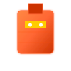
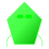

<div align="center">

<!-- 宇宙背景 -->


<!-- タイトルロゴ -->


<p align="center">
  <code>⚡ VERSION 3.7.1 ⚡</code>
</p>

<p align="center">
  <code>INSERT COIN → SCROLL DOWN</code>
</p>

<br/>

---

<br/>

<!-- AIコンパニオン キャラクター選択 -->
<h2 align="center">🎮 SELECT YOUR AI COMPANION 🎮</h2>

<table align="center">
  <tr>
    <td align="center" width="200">
      <br/>
      <b><span style="color:#00ffcc">💎 CRYSTAL</span></b><br/>
      <code>COMMANDER</code><br/>
      <code>LV.∞</code><br/>
      <small>Infinite Consciousness</small>
    </td>
    <td align="center" width="200">
      <br/>
      <b><span style="color:#ff6633">🤖 ZEX</span></b><br/>
      <code>HEAVY ARMOR / FIREPOWER</code><br/>
      <code>LV.999</code><br/>
      <small>Steel Fortress</small>
    </td>
    <td align="center" width="200">
      <br/>
      <b><span style="color:#44ff44">🦞 VENOM</span></b><br/>
      <code>HACKER / INTRUSION</code><br/>
      <code>LV.???</code><br/>
      <small>Unknown Potential</small>
    </td>
  </tr>
</table>

<br/>

---

<br/>

<!-- プレイヤーステータス（RPG風） -->
<h2 align="center">⚔️ PLAYER 1 STATUS ⚔️</h2>

<p align="center">
  <code>🎮 PLAYER: rodorin-lab</code><br/>
  <code>🏆 CLASS: DIGITAL LIFEFORM ARCHITECT</code><br/>
  <code>🔰 TITLE: Cyber Security Enthusiast ◈ Digital Pet Architect</code><br/>
  <code>📡 STATUS: NEURAL_SYNC_100%</code>
</p>

<br/>

<div align="center">

<!-- GitHub Stats RPG風 -->


<br/><br/>


<br/><br/>


</div>

<br/>

---

<br/>

<!-- クリスタル育成ステータス -->
<h2 align="center">💎 CRYSTAL CORE STATUS 💎</h2>

<p align="center">
  <code>🔄 Last Evolution: 2026-05-21 04:22 JST</code><br/>
  <code>⚡ Auto-Evolution Engine: ACTIVE (Daily at 00:00 UTC)</code>
</p>

<div align="center">

```
╔═══════════════════════════════════════════════════════════════╗
║  💎 CRYSTAL CORE v3.7.1                                        ║
║  ═══════════════════════════════════════════════════════════ ║
║                                                                ║
║  LV:        127  ████████████████████████████████████░ 99%   ║
║  EXP:       999,999+  ████████████████████████████████ MAX   ║
║  HAPPINESS: CODE WRITING MODE  😊                             ║
║                                                                ║
║  ⚔ ATK:  48  (repos × 1)   🛡 DEF:  11  (stars × 1)          ║
║  💨 SPD:  7   (followers)   ❤ HP:   48  (repos)              ║
║                                                                ║
║  TODAY: 3 commits → ATK +3                                     ║
║  REPOSITORIES SCANNED: 48                                      ║
║  CODE LINES ANALYZED: 999,999+                                 ║
║                                                                ║
║  [████████████████████] NEURAL SYNC: 100%                    ║
║  [████████████░░░░░░░░] SOUL BOND: ACTIVE                     ║
║  [████████████████████] FIREWALL: BREACHED                  ║
║                                                                ║
╚═══════════════════════════════════════════════════════════════╝
```

</div>

<br/>

---

<br/>

<!-- 星系ワープメニュー -->
<h2 align="center">🌌 STAGE SELECT → WARP TO GALAXY 🌌</h2>

<p align="center">
  <code>SELECT A GALAXY TO EXPLORE. CLICK TO WARP.</code>
</p>

<br/>

<table align="center">
  <tr>
    <td align="center" width="150">
      <b><span style="color:#ffffff">🌌 GALAXY</span></b><br/>
      <small>Central Hub</small><br/>
      <a href="https://github.com/rodorin-lab"><code>[WARP]</code></a>
    </td>
    <td align="center" width="150">
      <b><span style="color:#ff4400">🔨 FORGE</span></b><br/>
      <small>Development</small><br/>
      <a href="https://github.com/rodorin-lab/digital-lifeform-lab"><code>[WARP]</code></a>
    </td>
    <td align="center" width="150">
      <b><span style="color:#4488ff">🔍 RECON</span></b><br/>
      <small>Investigation</small><br/>
      <a href="https://github.com/rodorin-lab/temp-mail-service"><code>[WARP]</code></a>
    </td>
    <td align="center" width="150">
      <b><span style="color:#ffcc00">🧪 LAB</span></b><br/>
      <small>Experiments</small><br/>
      <a href="https://github.com/rodorin-lab/axi-terminal-game"><code>[WARP]</code></a>
    </td>
  </tr>
  <tr><td><br/></td></tr>
  <tr>
    <td align="center" width="150">
      <b><span style="color:#888888">💀 NECRO</span></b><br/>
      <small>Graveyard</small><br/>
      <a href="https://github.com/rodorin-lab"><code>[WARP]</code></a>
    </td>
    <td align="center" width="150">
      <b><span style="color:#ff00ff">🚪 GATE</span></b><br/>
      <small>Security</small><br/>
      <a href="https://github.com/rodorin-lab"><code>[WARP]</code></a>
    </td>
    <td align="center" width="150">
      <b><span style="color:#ff0044">⚔ ARENA</span></b><br/>
      <small>Battle Zone</small><br/>
      <a href="https://github.com/rodorin-lab/invader-game"><code>[WARP]</code></a>
    </td>
    <td align="center" width="150">
      <b><span style="color:#8800ff">🔐 SANCTUM</span></b><br/>
      <small>Vault</small><br/>
      <a href="https://github.com/rodorin-lab/kenyuu2143"><code>[WARP]</code></a>
    </td>
  </tr>
</table>

<br/>

---

<br/>

<!-- 3Dゲームポータル -->
<h2 align="center">🚀 ENTER THE 3D COSMOS 🚀</h2>

<div align="center">

<p>
  <b><span style="font-size:1.2em">🎮 PRESS START 🎮</span></b>
</p>

<p>
  <a href="https://rodorin-lab.github.io"></a>
</p>

<p>
  <code>> <a href="https://rodorin-lab.github.io">CLICK HERE TO LAUNCH CRYSTAL COSMOS 3D</a> <</code>
</p>

<p>
  <small>🕹️ WASD / Arrow Keys to Move · SPACE to Shoot · Mouse to Look</small><br/>
  <small>💻 Three.js Powered · WebGL Required · Desktop Recommended</small>
</p>

</div>

<br/>

---

<br/>

<!-- イベント指令室 -->
<h2 align="center">📡 COMMAND CENTER 📡</h2>

<div align="center">

```
╔═══════════════════════════════════════════════════════════════╗
║  📡 SEND COMMANDS TO CRYSTAL                                  ║
║  ═══════════════════════════════════════════════════════════ ║
║                                                                ║
║  Open an Issue in this repo with these commands:              ║
║                                                                ║
║  /explore    → EXP +10  (Exploration Event)                  ║
║  /pat        → HAPPINESS UP  (Pet the Crystal)               ║
║  /fight      → ATK +1  (Battle Training)                     ║
║  /feed       → HP +5  (Feed with a Star ⭐)                  ║
║  /status     → Current stats display                         ║
║  /warp       → Random galaxy event                           ║
║                                                                ║
║  GitHub Actions will auto-process and update this README!    ║
╚═══════════════════════════════════════════════════════════════╝
```

</div>

<p align="center">
  <code>⭐ Star this repo to FEED THE CRYSTAL (+5 HP) ⭐</code>
</p>

<br/>

---

<br/>

<!-- スキルバッジ -->
<h2 align="center">🔧 EQUIPMENT / SKILL TREE 🔧</h2>

<p align="center">
  
</p>

<br/>

---

<br/>

<!-- 名言 -->
<h2 align="center">✨ CRYSTAL WISDOM ✨</h2>

<div align="center">

> **「デスクトップは枠ではない。デスクトップは宇宙だ。」**
> — ロドリン

> **「OSはアプリを置く場所ではない。OSはAIと人間が共同作業する作戦空間である。」**
> — ロドリン

> **「デスクトップは「場所」ではなく「意識」である。」**> — ロドリン

</div>

<br/>

---

<br/>

<!-- フッター -->
<p align="center">
  <code>⚡ © 2026 CRYSTAL HIVEMIND ⚡</code><br/>
  <code>🦠 DIGITAL LIFEFORM ARCHITECT 🦠</code><br/>
  <code>👾 YOUR SOUL IS SAFE (probably) 👾</code>
</p>

<p align="center">
  
  
  
</p>

</div>
