<!-- 宇宙背景 -->

<!-- タイトルロゴ -->

  <code>⚡ VERSION 3.7.1 ⚡</code>

  <code>INSERT COIN → SCROLL DOWN</code>

 

---

 

<h2 align="center">🎮 SELECT YOUR AI COMPANION 🎮</h2>

AXI SPACE STATION // LOCAL NEURAL CORE ACTIVE

No cloud. No credits. Pure local power.

